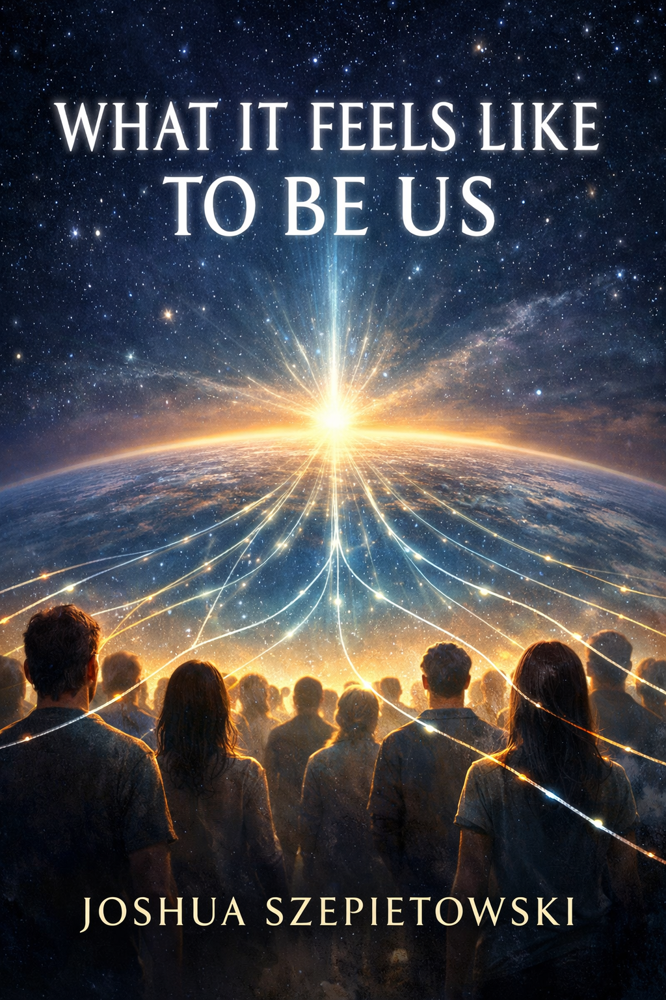

# What It Feels Like to Be Us

**Author:** Joshua Szepietowski

**Project Page:** https://what-it-feels-like-to-be-us.joshszep.com  
**Repository:** https://github.com/joshSzep/what-it-feels-like-to-be-us

---

## Overview

**What It Feels Like to Be Us** is a philosophical science fiction novel exploring empathy, consciousness, interconnection, and the limits of human separateness.

It is the third book in a companion trilogy:

1. **What It Feels Like to Be You** - [Book Page](https://what-it-feels-like-to-be-you.joshszep.com) | [Github Repository](https://github.com/joshSzep/what-it-feels-like-to-be-you)
2. **Only I Can Feel Me** - [Book Page](https://only-i-can-feel-me.joshszep.com) | [Github Repository](https://github.com/joshSzep/only-i-can-feel-me)
3. **What It Feels Like to Be Us** - [Book Page](https://what-it-feels-like-to-be-us.joshszep.com) | [Github Repository](https://github.com/joshSzep/what-it-feels-like-to-be-us)

The trilogy begins with the discovery of technology capable of sharing emotional experience between people.  
It then explores the consequences of exposing inner life to public interpretation.  
Finally, it asks what happens when the technology becomes widespread, global, and culturally transformative.

This final book examines a world where empath technology has escaped the lab, spread across the globe, and evolved into a new form of shared human experience.

---

## The Core Question

If people could truly feel each other's emotions, what would happen to society?

Would humanity become more compassionate?

Or would we simply invent new ways to exploit each other?

And if millions of people could share emotional states simultaneously, what would that feel like?

---

## The World

Fifteen years after the first empathy engine was created, the technology has become known simply as **emoting**.

People say things like:

> "Do you want to emote?"

Some nations regulate emoting tightly.  
Some prohibit it entirely.  
Others experiment with it openly.

Despite regulation, empath technology has spread through underground engineering, foreign labs, and global markets.

As with drugs, powerful experiences are difficult to contain.

---

## The New Frontier

A new technological breakthrough pushes emoting beyond individual connections.

Instead of one-to-one emotional sharing, researchers discover ways to create **mass shared emotional fields**.

Thousands.

Eventually millions.

For the first time in history, humanity experiments with experiencing emotion **together at planetary scale**.

The results are unpredictable.

The implications are profound.

---

## Themes

This novel explores themes including:

- subjective experience
- emotional privacy
- empathy and power
- regulation and technological escape
- cultural interpretation of consciousness
- the ethics of shared emotional experience
- interbeing
- equanimity
- awe
- the limits of separateness

At its deepest level, the story asks whether technology can reveal something that humans were always capable of experiencing.

---

## The Philosophical Arc of the Trilogy

| Book | Insight |
|-----|-----|
| **What It Feels Like to Be You** | Consciousness is mysterious and personal |
| **Only I Can Feel Me** | Subjective experience feels fundamentally private |
| **What It Feels Like to Be Us** | Connection is possible without erasing individuality |

The empathy machine does not ultimately solve the mystery of consciousness.

Instead, it reveals something quieter and more profound:

The distance between inner worlds may be smaller than we once believed.

---

## Repository Structure

This repository contains notes, outlines, and drafting materials used in the creation of the novel.

Key documents include:

- `AGENTS.md` — guidelines for AI collaboration
- `notes/PREMISE.md` — the central narrative premise
- `notes/THEMES.md` — thematic foundations of the story
- `notes/WORLD.md` — global worldbuilding
- `notes/CHARACTERS.md` — major characters and arcs
- `notes/OUTLINE.md` — narrative structure
- `notes/SCENES.md` — scene development
